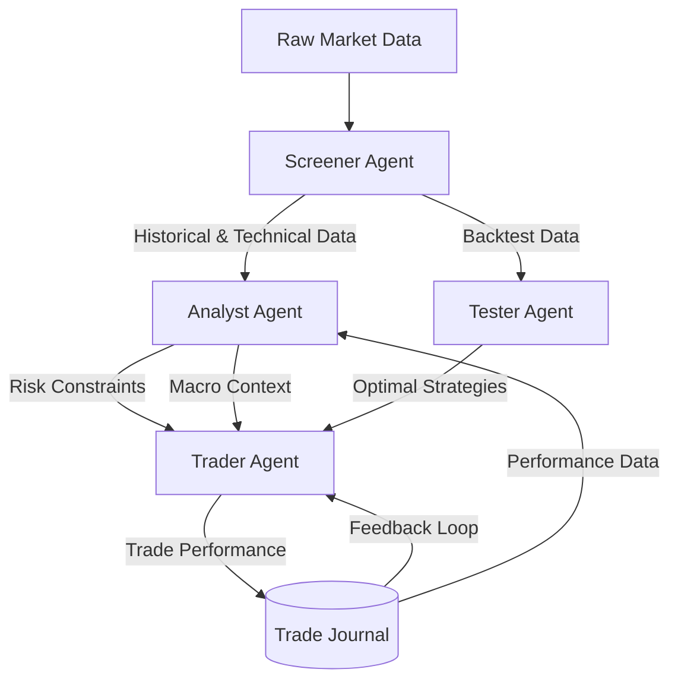

# Agentic Architecture: Self-Improving Stock Market Module

## Core Vision
To create a self-improving, self-learning stock market ecosystem powered by specialized autonomous agents. The system evolves from deterministic data processing to adaptive, intelligent execution.

## Agent System Overview

### 1. Screener Agent (The Foundation)
*   **Type**: Deterministic / Backend Engine
*   **Role**: Data Provider & Filter
*   **Learning**: None (Stateless/Deterministic)
*   **Responsibilities**:
    *   Ingest historical and live technical/financial data (NSE, Fyers).
    *   Execute predefined filters (e.g., "Volume Shockers", "52W High").
    *   Serve as the data backbone for other agents.
*   **Inputs**: Raw Market Data.
*   **Outputs**: Filtered Stock Lists, Technical Indicators.

### 2. Analyst Agent (The Brain)
*   **Type**: Multi-Agent System (Orchestrator)
*   **Role**: Insight, Risk Assessment & Macro Analysis
*   **Sub-Agents**:
    *   **Portfolio Analyzer**:
        *   Specializes in analyzing current holdings.
        *   Evaluates technical risk (Volatility, Beta) and financial risk.
        *   *Dependency*: Queries **Screener Agent** for historical/live data of held assets.
    *   **Market Analyzer**:
        *   Specializes in macro-economics, world affairs, and sector rotation.
        *   Ingests news, economic calendar, and global indices.
*   **Learning**: Contextual Adaptation (LLM-based).
*   **Inputs**: Portfolio State, Screener Data, News/Macro Data.
*   **Outputs**: Risk Reports, Sector Insights, Rebalancing Alerts.

### 3. Tester Agent (The Lab)
*   **Type**: Simulation Engine
*   **Role**: Strategy Validation & Optimization
*   **Responsibilities**:
    *   Ingest data from Screener Agent.
    *   Run varying parameters on historical data (Backtesting).
    *   Identify "Golden Parameters" for different market conditions.
*   **Learning**: Optimization Algorithms (Grid/Walk-Forward).
*   **Inputs**: Historical Data, Strategy Logic.
*   **Outputs**: Validated Strategies, Performance Metrics (Sharpe, Drawdown), "Reference Strategies" for Trader.

### 4. Trader Agent (The Executioner)
*   **Type**: Adaptive Autonomous Agent
*   **Role**: Live Execution & Continuous Improvement
*   **Responsibilities**:
    *   Takes "Reference Strategies" from **Tester Agent**.
    *   Adapts strategy execution based on real-time order flow and market microstructure.
    *   **Self-Improvement Loop**: Analyzes past trade performance to tune weighting and confidence thresholds.
*   **Learning**: Reinforcement Learning / Feedback Loops.
*   **Inputs**: Live Quote Stream, Validated Strategies (from Tester), Analyst Risk Constraints.
*   **Outputs**: Orders (Buy/Sell), Trade Journal, "Learning Experience" (Feedback for next cycle).

## Data Flow & Dependencies

## Implementation Roadmap

1.  **Screener**: Complete (ScreenerTable, API).
2.  **Analyst**:
    *   *Portfolio Analyzer*: Implemented (PortfolioRiskDashboard).
    *   *Market Analyzer*: **To Be Added** (News/Macro Dashboard).
3.  **Tester**: Implemented (BacktestHUD / Strategy Lab).
4.  **Trader**:
    *   *Execution*: Implemented (Terminal / Smart Trader).
    *   *Self-Learning*: **To Be Added** (Feedback Loop Logic).
