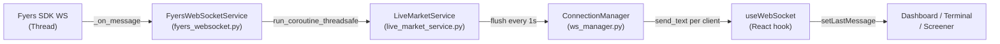

# WebSocket Integration — Technical Reference

> **Last updated:** 2026-02-16 · **Version:** v2.2 (stability hardened)
>
> This document is the single source of truth for the real-time data pipeline.
> Future agents: read this before modifying any WebSocket-related code.

---

## Architecture



### Component Roles

| Component | File | Role |
|---|---|---|
| `FyersWebSocketService` | `backend/app/services/fyers_websocket.py` | Fyers SDK wrapper. Runs in daemon thread, receives raw ticks, queues them thread-safely. |
| `LiveMarketService` | `backend/app/services/live_market_service.py` | Central orchestrator. Market hours enforcement, tick buffering (1s throttle), reconnect monitoring. |
| `ConnectionManager` | `backend/app/utils/ws_manager.py` | Client pool. Manages frontend WebSocket connections, subscription-based filtering, broadcasting. |
| WebSocket router | `backend/app/routers/websocket.py` | FastAPI endpoint. `/stream` WebSocket + REST helpers (`/connect`, `/subscribe`, `/status`). |
| `useWebSocket` | `frontend/hooks/useWebSocket.ts` | React hook. Connection lifecycle, heartbeat, exponential backoff reconnect. |

---

## Startup Sequence

Defined in `main.py` → `lifespan()`:

```
1. asyncio.get_running_loop()
2. manager.set_loop(loop)              ← ws_manager gets the event loop
3. Validate symbol_master (round-trip)
4. Validate database connection
5. Validate Fyers token (warn-only)
6. Load index universe (warn-only)
7. live_market.connect(loop=loop)      ← starts flush_loop, monitor_loop, Fyers WS thread
```

> [!IMPORTANT]
> `live_market.connect()` is **non-blocking**. The Fyers WebSocket connection runs in a daemon thread (`ws_thread_runner`). The function returns immediately after spawning the thread.

---

## Data Flow

### Tick Path (happy path)

```
Fyers SDK thread
  → FyersWebSocketService._on_message(tick)
    → asyncio.run_coroutine_threadsafe(_update_buffer(tick), loop)
      → LiveMarketService.tick_buffer[symbol] = tick   (latest-wins)

Every 1s:
  LiveMarketService._flush_loop()
    → batch = tick_buffer; tick_buffer = {}             (atomic swap)
    → for symbol, tick in batch:
        → manager.broadcast({"type": "ticker", "data": tick})
          → for connection in active_connections:
              → filter by subscription set
              → connection.send_text(json_msg)
```

### Thread Safety Model

| Boundary | Mechanism |
|---|---|
| Fyers thread → asyncio loop | `asyncio.run_coroutine_threadsafe()` in `handle_tick_incoming()` |
| Buffer read/write | Atomic reference swap: `batch = self.tick_buffer; self.tick_buffer = {}` — safe because both sides run on the asyncio event loop |
| Loop access in `FyersWebSocketService` | `threading.Lock` around `self.loop` (TOCTOU fix) |

---

## WebSocket Protocol

### Endpoint
```
ws://localhost:8000/api/websocket/stream
```

### Client → Server

| Message | Format |
|---|---|
| Subscribe | `{"action": "subscribe", "symbols": ["NSE:SBIN-EQ", "NSE:RELIANCE-EQ"]}` |
| Unsubscribe | `{"action": "unsubscribe", "symbols": ["NSE:SBIN-EQ"]}` |
| Heartbeat | `"ping"` (raw string) or `{"action": "ping"}` (JSON) |

### Server → Client

| Message | Format |
|---|---|
| Handshake | `{"type": "connection_established", "message": "..."}` |
| Ack | `{"type": "ack", "action": "subscribe", "count": 2}` |
| Tick | `{"type": "ticker", "data": {"symbol": "SBIN", "ltp": 500.5, ...}}` |
| Pong | `{"type": "pong"}` |

### Symbol Format Convention

| Layer | Format | Example |
|---|---|---|
| Frontend (display) | Short name | `SBIN` |
| WebSocket subscribe msg | Fyers format | `NSE:SBIN-EQ` |
| Broadcast / DB | DB format | `SBIN` |
| Fyers SDK | Provider format | `NSE:SBIN-EQ` |

Conversion is handled by `symbol_master.to_db()` and `symbol_master.to_fyers()` at the router boundary.

---

## Connection Lifecycle

### Backend: `ws_manager.connect()` — Disconnect-Safe Pattern

```python
async def connect(self, websocket: WebSocket) -> bool:
    try:
        await websocket.accept()
    except Exception:
        return False                       # Client gone before accept

    self.subscriptions[websocket] = set()
    # self.subscriptions keys act as the active connections registry

    try:
        await websocket.send_json({...})   # Welcome message
    except (WebSocketDisconnect, Exception):
        self.disconnect(websocket)
        return False                       # Client gone before handshake

    return True
```

> [!CAUTION]
> **Never** call `send_json()` directly from the endpoint or any handler. Always use `_safe_send()` which swallows `WebSocketDisconnect` and `RuntimeError`. This prevents log pollution from normal disconnects (React StrictMode double-mount, page navigation).

### Backend: `broadcast()` — Dead Connection Handling

```python
for connection in list(self.subscriptions.keys()):   # Copy for safe removal
    if connection.client_state.name != "CONNECTED":
        self.disconnect(connection)
        continue
    try:
        await connection.send_text(json_msg)
    except (WebSocketDisconnect, RuntimeError):    # Socket already closed
        self.disconnect(connection)
```

### Frontend: Reconnection Strategy

```
Base delay:   2s
Backoff:      2s × 2^retryCount
Cap:          30s
Max retries:  10
Reset:        retryCount resets to 0 on successful onopen
Clean close:  code 1000 → no reconnect (intentional unmount)
```

---

## Market Hours & Monitoring

### Market Hours

| Parameter | Value |
|---|---|
| Open | 09:15 IST |
| Close | 15:30 IST |
| Weekend | Sat/Sun — always closed |
| Override | `DEV_MODE=True` env var |

### Monitor Loop (`_monitor_loop`, 30s interval)

```
if market_open:
    if not connected → trigger connect()
    if was_connected but dropped → trigger reconnect
else:
    if connected → disconnect + cleanup
```

### Fyers Reconnect (`ws_thread_runner`)

```
max_retries: 5
retry_delay: 5s (fixed — TODO: exponential backoff)
on_failure:  calls on_ws_failure() which sets _is_connecting = False
```

---

## REST Endpoints

| Method | Path | Purpose |
|---|---|---|
| `POST` | `/api/websocket/connect` | Trigger Fyers WS connection (usually auto at startup) |
| `POST` | `/api/websocket/subscribe` | Subscribe symbols via REST (alternative to WS message) |
| `POST` | `/api/websocket/disconnect` | Close Fyers WS connection |
| `GET`  | `/api/websocket/status` | Connection status + market status |

---

## Frontend Integration

### Basic Usage

```typescript
import { useWebSocket } from '@/hooks/useWebSocket';

function MyComponent() {
  const { isConnected, lastMessage, sendMessage } = useWebSocket();

  // Subscribe to symbols
  useEffect(() => {
    if (isConnected) {
      sendMessage({ action: 'subscribe', symbols: ['NSE:SBIN-EQ'] });
    }
  }, [isConnected]);

  // Handle tick updates
  useEffect(() => {
    if (lastMessage?.type === 'ticker') {
      const { symbol, ltp, ch, chp } = lastMessage.data;
      // Update your component state
    }
  }, [lastMessage]);
}

### Optimized Usage (Zero Re-renders)

Use `skipStateUpdates: true` to bypass internal state updates.

```typescript
function OptimizedComponent() {
  const { registerCallback } = useWebSocket({ skipStateUpdates: true });

  useEffect(() => {
    return registerCallback((msg) => {
      // Handle high-frequency data without re-rendering this component
      store.dispatch(updateTicker(msg));
    });
  }, [registerCallback]);
}
```
```

### Hook Internals

| Feature | Implementation |
|---|---|
| URL resolution | `NEXT_PUBLIC_WS_URL` > derive from `NEXT_PUBLIC_API_URL` > `ws://127.0.0.1:8000` |
| Heartbeat | `"ping"` string every 30s |
| Pong filtering | `'{"type":"pong"}'` messages skipped before `JSON.parse` |
| Unmount cleanup | `socket.close(1000)` + clear timeouts/intervals |
| Double-mount guard | `isConnectingRef` + `isMountedRef` flags |

---

## Error Handling Best Practices

### Rule 1: Never throw on WebSocket disconnect

WebSocket disconnects are **normal** (page nav, tab close, StrictMode). Treat them as info-level, not error-level.

```python
# ✅ GOOD — in ws_manager.py
except (WebSocketDisconnect, RuntimeError):
    self.disconnect(connection)

# ❌ BAD — old code
except Exception as e:
    logger.error(f"Error: {e}", exc_info=True)  # Fills logs with stack traces
    raise
```

### Rule 2: Always use `_safe_send()` for outbound messages

```python
# ✅ GOOD — in websocket.py
await _safe_send(websocket, {"type": "ack", ...})

# ❌ BAD
await websocket.send_json({"type": "ack", ...})  # Throws if client is gone
```

### Rule 3: Check `connect()` return before entering message loop

```python
connected = await manager.connect(websocket)
if not connected:
    return  # Don't enter the while True loop
```

### Rule 4: Frontend reconnect must respect clean closure

```typescript
// Code 1000 = intentional close (unmount) → do NOT reconnect
if (event.code !== 1000) {
  // Exponential backoff reconnect
}
```

---

## Configuration

### Environment Variables

| Variable | Purpose | Default |
|---|---|---|
| `DEV_MODE` | Skip market hours check | `False` |
| `FYERS_APP_ID` | Fyers application ID | — |
| `FYERS_SECRET_ID` | Fyers secret key | — |
| `FYERS_TOKEN_FILE` | Path to access token JSON | `fyers/config/access_token.json` |
| `NEXT_PUBLIC_WS_URL` | Frontend WebSocket URL override | Derived from API URL |
| `NEXT_PUBLIC_API_URL` | Frontend API base URL | `http://localhost:8000` |

---

## Fixes Applied (v2.2)

### Crash: `ConnectionClosedError: no close frame received or sent`

**Root cause:** `ws_manager.connect()` did `accept()` → `send_json()` with no try/except. Client disconnects between these two calls (React StrictMode double-mount, page navigation) caused unhandled exceptions.

**Fix:** `connect()` now returns `bool`, catches `WebSocketDisconnect` during handshake, calls `self.disconnect()` to clean up.

### Crash: `starlette.websockets.WebSocketDisconnect`

**Root cause:** All `send_json()` calls in the endpoint were unguarded. Any client disconnect during subscribe/unsubscribe ACK caused exceptions.

**Fix:** Introduced `_safe_send()` helper that swallows `WebSocketDisconnect` and `RuntimeError`.

### Crash: `uvicorn.protocols.utils.ClientDisconnected`

**Root cause:** `broadcast()` caught `WebSocketDisconnect` but not `RuntimeError`, which Starlette raises when the underlying socket is already closed.

**Fix:** Added `RuntimeError` to the exception tuple in `broadcast()`.

### Log spam: Reconnect storm post-market

**Root cause:** Frontend reconnected every 1–10s with only 5 retries. After max retries, the component would re-mount and start over.

**Fix:** Backoff increased to 2s base / 30s cap, max retries increased to 10.

---

## 8. Performance Optimizations (Implemented v2.3)

The following optimizations maximize throughput and minimize latency:

1.  **Batch Broadcasting (`ticker_batch`)**:
    *   **Mechanism**: The `LiveMarketService` Aggregates all ticks received within the 1-second flush interval into a single JSON packet.
    *   **Impact**: Reduces WebSocket frame overhead by ~95% (e.g., sending 1 packet of 50 ticks vs 50 packets).
    *   **Frontend Support**: The `useWebSocket` hook automatically detects `ticker_batch` messages and unrolls them into individual events for compatibility.

2.  **Direct Dispatch (Zero-Hop)**:
    *   **Mechanism**: The `FyersWebSocketService` bypasses internal queues and calls `LiveMarketService.handle_tick_incoming` directly from the receiver thread.
    *   **Impact**: Removes 2 internal async scheduling hops, reducing tick-to-DB latency.

3.  **Frontend Optimization**:
    *   **Callback Registry**: Components can register callbacks via `registerCallback` to avoid global re-renders triggered by `lastMessage` state updates.
    *   **Visibility Pausing**: Processing is paused when the browser tab is hidden (`document.hidden`), saving CPU resources.

4.  **Connection Management**:
    *   **O(1) Lookups**: The `active_connections` list was consolidated into the `subscriptions` dictionary, ensuring O(1) removals and preventing list-walking overhead.
    *   **Exponential Backoff**: Reconnection logic now uses exponential backoff (up to 60s) to prevent "reconnect storms" during outages.

---

## Troubleshooting

### No tick data arriving

1. Check market hours (09:15–15:30 IST) or set `DEV_MODE=True`
2. Verify Fyers token: `curl http://localhost:8000/api/system/health`
3. Check WebSocket status: `curl http://localhost:8000/api/websocket/status`
4. Confirm frontend subscribed: check Network → WS tab for `subscribe` message and `ack` response

### WebSocket connects then immediately disconnects

1. Check for React StrictMode double-mount (normal in dev — both mounts will try to connect)
2. Verify CORS allows your frontend origin in `main.py`
3. Check if another tab already has an active connection

### Frontend shows "disconnected" during market hours

1. Check backend logs for `[WS] Connection dropped during market hours`
2. Verify Fyers token hasn't expired mid-session
3. Try `POST /api/websocket/connect` to trigger manual reconnect

---

## Version History

| Version | Date | Changes |
|---|---|---|
| v1.0 | — | REST-only polling |
| v2.0 | — | WebSocket push model with market hours enforcement |
| v2.1 | — | Executor pattern, atomic buffer, lifespan handler |
| v2.2 | 2026-02-16 | Stability hardening: disconnect-safe connect, `_safe_send()`, RuntimeError handling, backoff tuning |
| v2.3 | 2026-02-16 | **Performance Audit Fixes**: Batching, Direct Dispatch, Callback Pattern, Visibility Pause. |
